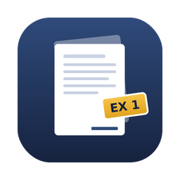

<p align="center">
  
</p>

<h1 align="center">Exhibit Maker</h1>

<p align="center">Turn a stack of PDFs into one exhibit-tabbed, Bates-numbered PDF — on your Mac, offline.</p>

---

## Features

- **Drag and drop** PDFs (or a whole folder) and reorder them by dragging.
- **Exhibit tab pages:** a slip sheet reading "EXHIBIT 1" (or A, B, C…) before each document, optionally with its description.
- **First-page exhibit stamp:** a boxed "EXHIBIT 1" in the top-right corner of each exhibit's first page.
- **Bates numbering:** continuous numbers (e.g. `CITY000001`) in the bottom-right corner of every page, with your prefix, starting number and digit count. Tab pages can be numbered or skipped.
- **Live Bates ranges** for each exhibit, and **Copy Index** to paste an exhibit list (label, description, Bates range, pages) into Word or Excel.
- **Permanent stamps:** labels and numbers are drawn into the page content, not added as removable annotations.
- **Private:** everything runs locally; no network access. Your settings are remembered.

## Requirements

- macOS 13 Ventura or later
- Apple's Command Line Tools: `xcode-select --install`

## Install

1. Download this repository (**Code → Download ZIP**) and unzip it.
2. Double-click **Install or Update.command** (right-click → **Open** the first time if macOS blocks it), or run:
   ```
   bash ~/Downloads/ExhibitMaker/build.sh
   ```

The app is installed in `/Applications`. Run the same script to update.

## Notes

- Password-protected PDFs must be unlocked first.
- Pages keep their original size and orientation; tab pages are US Letter.
- Review the output before filing or producing it.

## License

[MIT](LICENSE)
